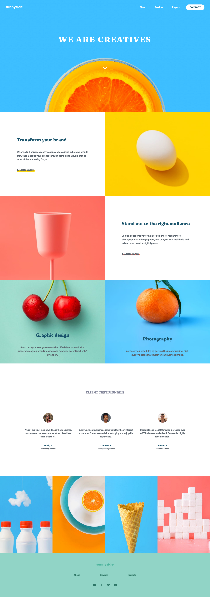
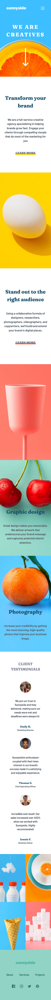

# Frontend Mentor - Sunnyside agency landing page solution

This is a solution to the [Sunnyside agency landing page challenge on Frontend Mentor](https://www.frontendmentor.io/challenges/sunnyside-agency-landing-page-7yVs3B6ef). Frontend Mentor challenges help you improve your coding skills by building realistic projects.

## Table of contents

- [Overview](#overview)
  - [The challenge](#the-challenge)
  - [Screenshot](#screenshot)
  - [Links](#links)
- [My process](#my-process)
  - [Built with](#built-with)
  - [What I learned](#what-i-learned)
  - [Continued development](#continued-development)
  - [Useful resources](#useful-resources)
- [Author](#author)
- [Acknowledgments](#acknowledgments)

**Note: Delete this note and update the table of contents based on what sections you keep.**

## Overview

### The challenge

Users should be able to:

- View the optimal layout for the site depending on their device's screen size
- See hover states for all interactive elements on the page

### Screenshot

### Links

- Solution URL: [Add solution URL here](https://www.frontendmentor.io/solutions/sunnyside-agency-app-made-with-reacttypescript-3Y-xUrnMX)
- Live Site URL: [Add live site URL here](https://dinarocio.github.io/Sunnyside-agency/)

## My process

It did take some weeks to complete this challenge, specially because I didn't use so much Grid Layout, so I did have to check some articles before, and fix some accessibility issues. After that I think to learn the best method to deploy typescript apps to Github Pages which makes me very happy.

### Built with

- Semantic HTML5 markup
- Style Components with Emotion
- Flexbox
- CSS Grid
- Desktop-first workflow
- [TS](https://www.typescriptlang.org/docs/handbook/intro.html) - Language
- [React](https://es.reactjs.org/) - React framework

### What I learned

Setting and deploying React+Typescript projects.
Grid Layout
Smooth Scrolling (really easy btw)

### Continued development

I expect to create mobile menu modal and maybe add some interaction to the 'LEARN MORE' anchors.

### Useful resources

- [Smooth Scrolling](https://www.youtube.com/watch?v=yg9We54OxmE) - This helped me to learn how to do the smooth scrolling.
- [Deploy in GH pages](https://platzi.com/tutoriales/1548-react/4065-guia-para-usar-github-pages-en-tus-proyectos-de-reactjs/) - This helped me a lot deploying this site.

## Author

- Frontend Mentor - [@DinaRocio](https://www.frontendmentor.io/profile/DinaRocio)

## Acknowledgments

My cat Lunita
